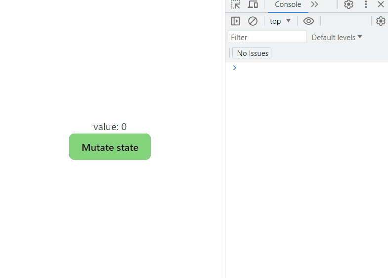
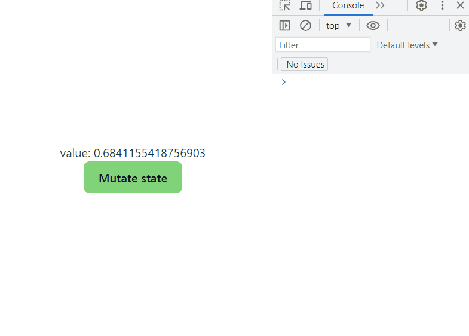

# useEffect vs useLayoutEffect

There are many resources available where one can learn about the differences between useEffect and useLayoutEffect. Yes, it is well-known that the main difference is that useEffect works asynchronously, and the browser paints the new DOM before the hook's completion. In the case of useLayoutEffect, it works synchronously, and the browser waits for the hook's completion before painting.

To gain a better understanding, I provide yet another example to help visualize this difference. There are 4 examples with explanations provided in `App.tsx`. One can play with them by uncommenting the necessary sections.

## To run app
```
npm i
npm run dev
```

## Demonstration GIFs

useEffect - the browser has time to paint the first change of the state. Consequently, one might observe flickering or delays.

Flickering



Delays



useLayoutEffect - the browser paints the final state of DOM only (no flickering or delay)


